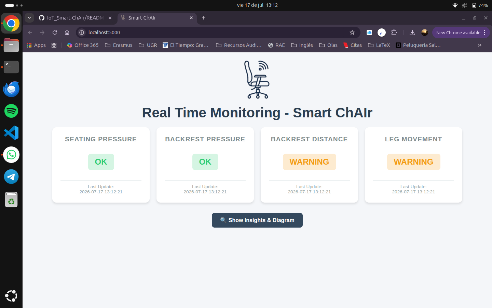
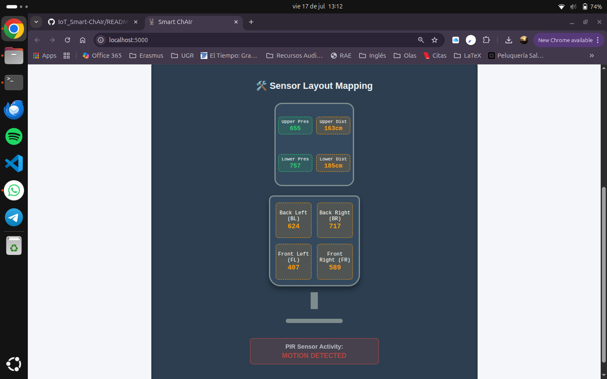

# IoT Smart-ChAIr: Sit SMART! 🪑💡

### Privacy-Preserving Posture Monitoring System

<p>
  
  
  
  
  
  
  
  
  
  
</p>

**Internet of Things — Summer Term 2026**

**Developed by:** Michael Breyer, Sebghatullah Yarzada, Arturo Olivares, Reza Falahatkar, and Atena Mahrooghi.

---

## 📋 Project Description

**IoT Smart-ChAIr** is an intelligent posture monitoring system designed to combat physical issues arising from sedentary lifestyles in office and gaming environments. Through a distributed network of physical sensors embedded within a chair, the system analyzes pelvic weight distribution and back alignment in real time without compromising user privacy (completely camera-free).

If a poor sitting posture is detected and sustained for a specific threshold (5 seconds in the prototype stage), the system triggers a local audible warning via a buzzer and logs the telemetry data on an interactive Python web dashboard.

---

## 👨‍💻 My Contribution

As a member of the development team, I contributed to the overall system design and implementation of the Smart-ChAIR project. My main contributions included:

- Contributed to the overall concept and posture detection logic using FSR, ToF, and PIR sensors.
- Implemented, tested, and calibrated the FSR sensors on the ESP32.
- Integrated and combined firmware modules developed by different team members.
- Developed and tested the buzzer alert functionality.
- Prepared the complete Bill of Materials (BOM) for the project.
- Participated in hardware integration, testing, debugging, and system validation.

  ---
## 🛠️ Hardware & Components

The chair ecosystem is divided into data capture modules (*Chair*) and alert stations (*Desktop Station*) utilizing the following components:

* **Microcontrollers:** 2x ESP32 Dev Boards (`Joy-it SBC-NodeMCU-ESP32-C`) utilizing built-in communication via *ESP-NOW / Wi-Fi*.
* **Pressure Sensors (FSR):** 6x `Interlink 30-81794` sensors (4 embedded in the seat cushion, 2 in the lower backrest cushion) to map pelvic balance and lean offsets.
* **Distance Sensors (ToF):** 2x `STEMMA QT VL53L4CD` Time-of-Flight infrared distance sensors placed on the upper backrest to monitor upper body and head positioning.
* **Motion Sensor (PIR):** 1x `Joy-it SEN-HC-SR501` sensor mounted underneath the seat to detect user presence and tracking daily inactivity patterns.
* **Alarm Actuator:** 1x Active Buzzer `KY-012` for local, real-time auditory notifications.

---

## 🌐 IoT & MQTT Network Architecture

The communication core of the Smart-ChAIr relies entirely on a lightweight, publish-subscribe network driven by the MQTT (Message Queuing Telemetry Transport) protocol, following a specific data flow:

1. **Data Encoding (JSON Payload)**: The ESP32 microcontroller aggregates the raw readings from the physical sensors (FSR, ToF, and PIR) and packages the sensor readings into a structured JSON payload. This payload guarantees modular data parsing on the receiver end.
2. **Local Broker Deployment (Eclipse Mosquitto)**: The JSON payload is published from the hardware node over Wi-Fi directly to a local MQTT network broker running an instance of Eclipse Mosquitto hosted on the host computer.
3. **Backend Python Subscription**: The `subscriber_web.py` script utilizes an MQTT client framework to establish a persistent connection with the Mosquitto server. It subscribes to the specific data topics emitted by the chair, continuously intercepts incoming JSON strings, unpacks them asynchronously, and feeds the live metrics directly into the frontend user dashboard interface.

---

## 📁 Repository Structure

The project directory is structured as follows:

```text
├── PartList.xlsx                # Official component checklist, costs, and suppliers.
├── README.md                    # Main system documentation.
│
├── 📂 Slides                    # Project slide decks.
│   ├── Pitch.pptx              # Initial conceptual short pitch.
│   └── FinalPresentation.pptx  # Comprehensive technical presentation and defense.
│
├── 📂 TestingPrograms          # Firmware for isolated hardware unit testing.
│   ├── Buzzer.ino              # Basic active/passive buzzer testing.
│   ├── PIR.ino                 # Calibration and motion capture validation script.
│   ├── ToF.ino                 # Individual I2C time-of-flight sensor readouts.
│   ├── Multiple_ToF.ino        # Simultaneous multi-sensor ToF management.
│   ├── Multiple_ToF_Test.ino   # Advanced validation scripts for backrest telemetry.
│   ├── Version1_RawFSR.ino     # Primary raw analog data acquisition from FSRs.
│   ├── Version2_LocalDecision.ino # Microcontroller-side edge computing & local decision logic.
│   └── Combine.ino             # Full sensor array integration on the main chair board.
│
└── 📂 WebPage                  # Web ecosystem, API, and Graphical User Interface (Dashboard).
    ├── requirements.txt        # Backend dependencies and required libraries.
    ├── publisher.ino           # ESP32 production firmware publishing sensor payloads.
    ├── publisher.py            # Local python script that simulates the ESP32 messages (for testing purposes).
    ├── subscriber_web.py       # Core application running the subscriber agent and Flask web server.
    ├── 📂 templates            # HTML structural blueprints for the Dashboard.
    └── 📂 static               # CSS stylesheets, JavaScript files, and dashboard visual assets.
```

---

## ⚙️ Posture Notification Logic

The system continuously checks the user's posture state and reacts based on thresholds:

| State | Activation Condition | System Response |
| --- | --- | --- |
| **OK** ✅ | Balanced weight on FSRs and optimal ToF backrest distances. | Passive telemetry tracking on the Dashboard. |
| **Warning** ⚠️ | Minor slouching or uneven pelvic pressure distribution detected. | Timestamped logging and warnings on the web analytics. |
| **Alarm** 🚨 | Critical poor posture sustained for more than 5 seconds. | **Immediate local buzzer alert** (Levels 1-4) + Visual layout alert. |

---

## 🚀 Installation & Deployment

### 1. Flashing the Firmware (Microcontrollers)

1. Open the **Arduino IDE**.
2. Make sure to download and install the required library dependencies for the `VL53L4CD` distance sensors and analog pin handling.
3. For individual hardware debugging, run the units inside `/TestingPrograms`.
4. For final production environments, compile and flash `/WebPage/publisher.ino` onto your designated ESP32 development boards.

### 2. Setting Up the Web Platform & MQTT Broker

To deploy the communication environment and view live posture analytics:

1. Ensure an instance of the Mosquitto broker is running locally on your computer:
```bash
# On Ubuntu/Debian
sudo systemctl start mosquitto
# On macOS (Homebrew)
brew services start mosquitto
```

2. Navigate to the server directory:
```bash
cd WebPage
```

3. Activate your Python virtual environment:
```bash
source .venv/bin/activate  # On Linux/Mac
# Or use: .venv\Scripts\activate  # On Windows
```
4. Install all the necessary backend dependencies:
```bash
pip install -r requirements.txt
```
5. Run the web subscriber application to bind with the local broker:
```bash
python subscriber_web.py
```
6. Launch your browser and go to the local IP address provided in the terminal console output (e.g., `http://127.0.0.1:5000`) to view live sensor tracking mapping.

---

## 📊 Experimental Results & Web Analytics

The fully integrated hardware prototype successfully captures and visualizes user posture metrics without relying on privacy-invasive cameras. 

### 1. Physical Prototype & Hardware Deployment
The physical sensor matrix is directly embedded into the chair's structure, allowing unobtrusive data acquisition:
* **Seat Cushion Matrix:** 4x FSR pressure points track the user's center of mass and pelvic leaning tendencies.
* **Backrest Array:** Time-of-Flight (ToF) and pressure sensors monitor upper-body curvature and lumbar engagement.

<p align="center">
  
  <br><em>Figure 1: Complete physical prototype integration mapping telemetry live to the workstation dashboard.</em>
</p>

### 2. Live Web Dashboard Overview
The Flask web server receives data via the local MQTT broker and visually updates the user's ergonomic health quadrants dynamically:

<p align="center">
  
  <br><em>Figure 2: Real-time status tracker indicating warning flags on upper body metrics.</em>
</p>


### 3. Sensor Layout Mapping & Insights
By selecting **"Show Insights & Diagram"**, the interface exposes the exact mathematical distribution of the physical sensor network:

<p align="center">
  
  <br><em>Figure 3: Graphical overlay of individual sensor nodes mapping live numerical metrics.</em>
</p>
